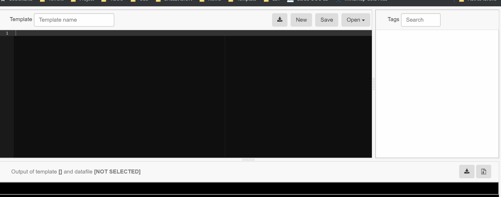

# SmartNetConf
* SmartNetConf is a simple (Web Gui Application) that let you generate a configuration from a (JINJA2 Template and CSV File)

Live apps is available at [http://smartnetconf.shellvision.com](http://smartnetconf.shellvision.com)
(This live Apps is deployed on AWS Lambda, so no data will be saved)

## Preview

### Installation : (Example with Ubuntu)
    ** use if there is already a wsgi module for python2, we need to remove it and install wsgi for python 3**
    apt remove libapache2-mod-wsgi

    apt install apache2 virtualenv
    cd /var/www
    git clone https://github.com/SmartNetConf/SmartNetConf.git
    cd SmartNetConf
    apt -y install libapache2-mod-wsgi-py3
    a2enmod wsgi
    virtualenv -p python3 ./venv3
    source ./venv3/bin/activate
    pip install Flask
    pip install PyYAML
    chown www-data:www-data -R /var/www/SmartNetConf

### Edit Apache configuration file 
    vi /etc/apache2/apache2.conf

### if you want to work with Virtual Host, you can use a file named "virtual_HostApacheIfNeeded.conf" in root directory
    ln -s /var/www/SmartNetConf/virtual_HostApacheIfNeeded.conf /etc/apache2/sites-available/
    a2ensite virtual_HostApacheIfNeeded

### Add the following
#### If you want an Apache Global configuration WITHOUT Authentification
    WSGIDaemonProcess SmartNetConf user=www-data group=www-data threads=5
    WSGIScriptAlias / /var/www/SmartNetConf/SmartNetConf.wsgi
    <Directory /var/www/SmartNetConf>
        WSGIProcessGroup SmartNetConf
        WSGIApplicationGroup %{GLOBAL}
        Require all granted
    </Directory>
        ErrorLog  /var/log/apache2/error-SmartNetConf.com.log
        CustomLog /var/log/apache2/access-SmartNetConf.com.log combined

#### If you want an Apache Global configuration WITH Authentification (advised)
    WSGIDaemonProcess SmartNetConf user=www-data group=www-data threads=5
    WSGIScriptAlias / /var/www/SmartNetConf/SmartNetConf.wsgi
    <Directory /var/www/SmartNetConf>
        WSGIProcessGroup SmartNetConf
        WSGIApplicationGroup %{GLOBAL}
        AuthType Basic
        AuthName "Restricted Content"
        AuthUserFile /var/www/SmartNetConf/.htpasswd_SmartNetConf
        Require valid-user
    </Directory>
        ErrorLog  /var/log/apache2/error-SmartNetConf.com.log
        CustomLog /var/log/apache2/access-SmartNetConf.com.log combined

##### Create the .htpasswd file (user = admin/password = choose one)
    htpasswd -c /var/www/SmartNetConf/.htpasswd_SmartNetConf admin

### Restart Apache service
    service apache2 restart

### You should be able to access SmartNetConf page
http://IPofYourServer

### If there an issue, check Apache logs
    tail -f /var/log/apache2/*
Then watch what is the error when you try to access the page

## Built With

* [jinja2-live-parser](https://github.com/qn7o/jinja2-live-parser) - A lightweight live parser for Jinja2 based on Flask and Jquery.
* [ACE](https://github.com/ajaxorg/ace) -Ace is a standalone code editor written in JavaScript
* Other that I may forgot

## License

This project is licensed under the MIT License - see the [LICENSE.md](LICENSE.md) file for details
